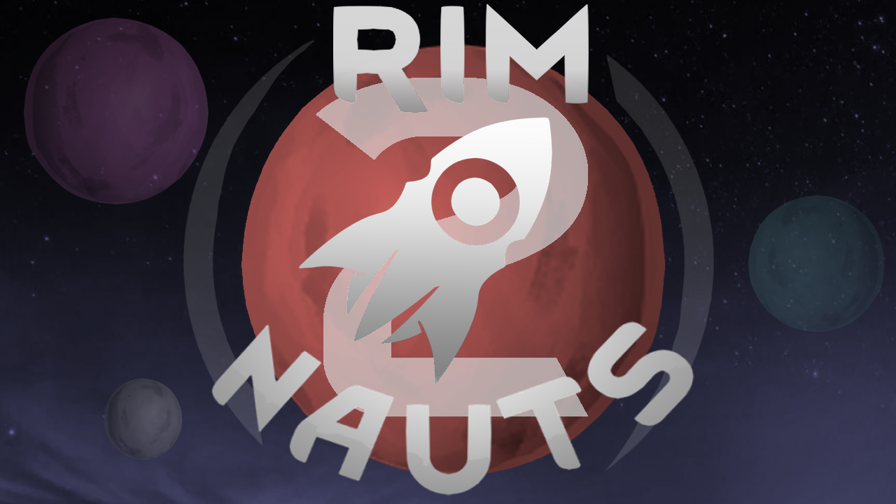

# RimNauts 2 — Reforged

**Asteroids, moons, satellites and planets for the RimWorld world map — ported to 1.6.**

---

## What this is

The original **RimNauts 2** stopped at RimWorld 1.5. This is a port to **1.6**, made to work
together with **[Universum](https://github.com/DGZ-DEV/Universum-Reforged-)**, its framework
dependency, which has its own port.

It adds a ring of asteroids, moons, satellites and planets to the world map, reachable with
transport pods built from the mod's own modules.

## Requirements

| Mod | Why |
|---|---|
| **[Harmony](https://steamcommunity.com/sharedfiles/filedetails/?id=2009463077)** | Both this and Universum need it |
| **[Universum (1.6 port)](https://github.com/DGZ-DEV/Universum-Reforged-)** | Framework dependency — without it, the mod will not load |

## Installation

1. Copy `Rimnauts 2 (Reforged)` and `Universum (Reforged)` into RimWorld's `Mods` folder.
2. Enable **Harmony**, **Universum** and **RimNauts 2** in the mod list, in that order.
3. **Generate a new world** — the celestial objects are placed when the world is generated.

## What the port fixed

Everything below **compiled fine in 1.5 and was broken in ways that produced no error message** —
which is why they are worth listing:

| Problem | Cause |
|---|---|
| **The generator never ran.** The world looked normal and had no asteroids. | In 1.6, inheriting `WorldGenStep` is not enough: the step needs its def **and** the planet layer must list it. Only the def existed. |
| **Pods had no buttons at all.** | The pod's defensive component was missing its fuel comp, so the game could not evaluate it and the whole gizmo list was lost. |
| **Celestial objects were invisible.** | Their meshes were built without texture coordinates, so Unity refused to render them. |
| **Textures failed to load.** | The mod splits its content between the root folder and a version folder; the folder map has to list both. |
| **A def field that 1.6 no longer has** (`causesNeed`) and an Ideology relic warning. | Definition cleanup. |

## Known limitations

Documented rather than hidden — a port should say what it does not do:

<b>The planet-in-the-sky effect no longer renders</b>

In 1.6 the geometry that fed it does not exist. The framework now detects this and stops trying,
instead of filling the log with thousands of warnings. The map itself renders normally.

<b>Travelling to the ring asteroids is not possible yet</b>

The game's launch targeting only accepts destinations that **already have a generated map**, and
the ring asteroids do not have one. Planets and satellites work, because the pod creates them with
a map.

<b>One framework patch is retired, with a warning</b>

`SectionLayer_FinalizeMesh` is disabled: the method it patched moved to a different class in 1.6,
and its body depends on members that method no longer exposes. It needs rewriting, not repointing.

## Credits

**RimNauts 2** was created by **Sindre Eiklid** and released under the **MIT license**, which is
preserved in this repository together with the original copyright notice.

- Original source: <https://github.com/RimNauts/RimNauts2>
- Original Steam Workshop page: <https://steamcommunity.com/sharedfiles/filedetails/?id=2880599514>

**Universum**, the framework dependency, is by **Rimworld: Space Project**, also MIT, and has its
own port repository.

This port keeps the original authorship untouched. The author's own README is preserved as
[`README.original.md`](README.original.md).

## Development notes

The commit history is the documentation: every fix has a commit explaining **what was broken,
why, and how it was found**. The first commit is the pristine original, so the whole port can be
reviewed as a single diff.

